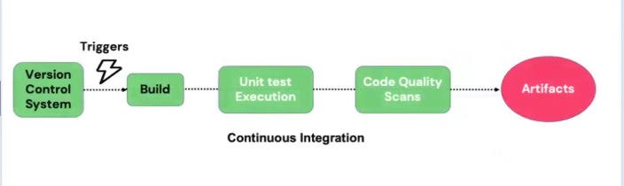
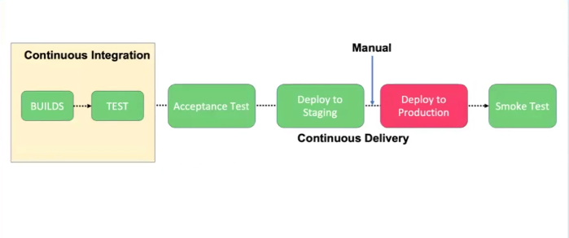
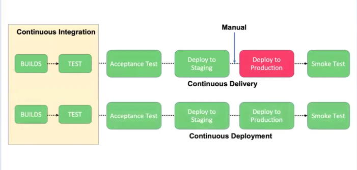

# DevOps Lifecycle

A set of practices and principles that helps software developers and IT operations team work together more effectively. The goal of DevOps is to make the process of developing and delivering software faster, more efficient and more reliable.

`**DevOps**` is a **cultural** and **technical** movement that unites **people**, **processes**, and **tools** to deliver software faster, safer, and with continuous improvement.

## SDLC (Softwre Development Life Cycle)

The Software Development Life Cycle (SDLC) is a structured approach to software development that outlines the various stages involved in creating and maintaining software applications. The main phases of SDLC include:

1. **Brainstorming & Setting Goals**

    - Problem visualization
    - The need to solve or provide a solution

2. **Requirements Analysis & Plan (3 Months)**

    - Functional Requirements - Login page, Dashboard,Sign Up, Forget Password
    - Non-functional Requirements - HA, FT, SLA
    - SRS is also created (Software Requirement Specification)
    - Project Duration
    - Business/Stakeholder approval

3. **Design & Architecture (4 Months)**

    - Design system architecture (Monolithic/Microservices)
    - System Integration
    - UI/UX Design/Wireframing
    - Database architect (Design database schema)
    - Technical document creation to be used by the developer

4. **Coding & Implementation (6 Months)**

    - Backend logic development
    - Unit Test
    - Code review and refactoring

5. **Testing & QA (2 Months)**

    - Develop test cases
    - Integration testing
    - System testing
    - Report back to developer if bug is detected

6. **Deployment (2 Months)**

    - System Administrators
    - Setup environments
    - Smoke test for software validation

7. **Maintenace & Feedback**

    - Provide feeback
    - Plan maintenance procedure

## Key poinnts in Waterfall Model

1. Linear and sequential approach
2. Ease of management
3. Limited Flexibility

## Challenges in Waterfall Model

1. Inflexibility to changes
2. Delayed Feedback
3. Long Delivery Cycles
4. Difficult in Managing Uncertainty
5. Limited Collboration

## Agile Methodoloy

Agile focuses on creating software in small, repeated steps, getting quick feedback, and collaborating with different people involved in the process.

    - An Outcome-Driven Approach
    - Agile is a way of working
    - Agile is a Set of Values and Principles
    - A Cultural Shift in an organization
    - Agile is a Mindset

### Goal of Agile

    - Deliver working software frequently
    - Speed matters
    - Quality is key

## Lean Methodology

Lean is an approach that aims to deliver value to customers while reducing the waste and maximizing efficiency. It emphasizes finding ways to eliminate unecessary steps, streamline the process, and work collaboratively.

## Continuous Integration (CI)

Continuous Integration is a software development practice where developers frequently merge their code changes into a shared repository. Each integration is automatically tested to detect errors early, ensuring that the codebase remains stable and functional.

**Tools:**

    - GitHub/Bitbucket (Version Control)
        - Triggers after code push
    - Jenkins/GitLab (Build: CI Systems)
        - Takes application source code from repository
        - Add all the dependencies
        - Compiles the code
        - Build artifacts
    - (Unit Test)
    - (Code Quality Scan)
    - (Artifact: Zip file, Docker image, Kubernetes pod)

## Continuous Delivery (CD)

Continuous Delivery is a software development practice where code changes are automatically built, tested, and prepared for release to production. It allows teams to deliver updates to users quickly and reliably.

**Tools:**

    - Jenkins/GitLab (CD Systems)
        - Takes build artifacts from CI system
        - Deploys to different environments (Dev, Test, Staging)
        - Automated tests in each environment
        - Manual approval for production deployment
    - AWS CodeDeploy/Ansible/Kubernetes (Deployment Tools)
        - Automates the deployment

### The Need for Continuous Deployment

    - Risk Management & Compliance
    - Business Readiness & Feature Flags
    - Production Stability & Controlled Releases

## Continuous Deployment (CD)

Continuous Deployment is an extension of Continuous Delivery where code changes are automatically deployed to production without manual intervention. It enables rapid and frequent releases, ensuring that new features and bug fixes reach users as soon as they are ready.

**Tools:**

    - Jenkins/GitLab (CD Systems)
        - Takes build artifacts from CI system
        - Deploys to different environments (Dev, Test, Staging)
        - Automated tests in each environment
        - Automatically deploys to production if all tests pass
    - AWS CodeDeploy/Ansible/Kubernetes (Deployment Tools)
        - Automates the deployment

## DevOps

**DevOps** is a `**cultural**` and `**technical**` movement that unites `**people**`, `**processes**`, and tools to deliver software faster, safer, and with continuous improvement.

DevOps is a set of practices that combines software development (Dev) and IT operations (Ops). It aims to shorten the development lifecycle and provide continuous delivery with high software quality. DevOps emphasizes collaboration, automation, and monitoring throughout the entire software development process.

### Automation Monitoring at SDLC

1. Automation is a repetitive task
2. Collaboration improves communication and leading to faster feedback and resolve issues
3. Continuous Integration ensure changes works togehter. Continuous Delivery/Deploy is the process of automatically packaging and deploying these changes to Prodution to make them available for users
4. Infrastructure as Code is an approach where infrastructure resources like servers, networks, databases are managed.
5. Monitoring & Feedback is the continuously observing the performance of software applications in real time.

### Roles of DevOps Engineers

1. Collaboration and Communication
2. Automation and Scripting

| Task                | AWS Service         | Non-AWS Tool                                       |
|---------------------|---------------------|----------------------------------------------------|
| Source Code Tool    | AWS CodeCommit      | Git, GitHub, GitLab                                |
| Build & Test        | AWS CodeBuild       | Jenkins                                            |
| Deploy              | AWS CodeDeploy      | Jenkins, Ansible, Kubernetes, Chef, Puppet, Docker |
| Monitor & Feedback  | Amazon CloudWatch   | Nagios, Splunk, ELK Stack                          |
| Automate Pipeline   | AWS CodePipeline    | Jenkins, Travis CI, GitLab                         |

## Introduction to Jira

Jira is a popular tool used for project management and issue tracking, especially in software development. It helps teams plan, track, and manage their work effectively.

### Key Features of Jira

1. **Issue Tracking:** Create and manage tasks, bugs, and user stories.

2. **Project Management:** Organize work into projects, sprints, and backlogs.

3. **Custom Workflows:** Define and customize workflows to match your team's processes.

4. **Collaboration:** Comment on issues, share files, and mention team members.

5. **Reporting:** Generate reports and dashboards to track progress and performance.

6. **Integration:** Connect with other tools like Confluence, Bitbucket, and Slack.

### What is Epic?

- An **Epic** is a large body of work that can be broken down into smaller tasks called stories. It represents a significant feature or initiative that may take several sprints to complete.

**Epic** --> **Feature area** --> **Product Blacklock** --> **User Stories** --> **Tasks**

Examples of **Epic**: 

    - User Account Management
    - Product Browsing & Search
    - Checkout & Payment

### What is Scrum?

- **Scrum** is a lightweight framework that helpd people, teams and organizations generate value through adaptive solutions for complex problems.

### Scrum Elements

| Scrum Roles       | Scrum Artifacts     | Scrum Events          |
|-------------------|---------------------|-----------------------|
| Product Owner     | Product Backlog     | Sprint                |
| Scrum Master      | Sprint Backlog      | Sprint Planning       |
| Developers        | Increment           | Daily Scrum           |
| DevOps Engineers  |                     | Sprint Review         |
|                   |                     | Sprint Retrospective  |

1. Product Backlog: A prioritized list of features, enhancements, and bug fixes that need to be addressed in the project.

2. Sprint Backlog: A subset of items from the product backlog that the team commits to completing during a specific sprint (usually 2-4 weeks).

3. Sprint Planning: A meeting where the team selects items from the product backlog to include in the sprint backlog and plans how to accomplish them.

4. Daily Scrum: A short daily meeting where team members share updates on their progress, discuss any obstacles, and plan their work for the day.

5. Sprint Review: A meeting at the end of the sprint where the team demonstrates the completed work to stakeholders and gathers feedback.

6. Sprint Retrospective: A meeting where the team reflects on the sprint, discusses what went well, what could be improved, and plans for future improvements.

7. Product Owner: Is responsible for defining the features and requirements of the product, prioritizing the product backlog, and ensuring that the team delivers value to stakeholders.

8. Scrum Master: Facilitates the Scrum process, helps the team adhere to Scrum practices, removes obstacles,
and ensures effective communication and collaboration within the team.

9. Developers: Is a cross-functional group of professionals who are responsible for delivering the product increment during the sprint. They work collaboratively to design, develop, test, and deliver the product.

| Scrum Roles       | Scrum Artifacts                               | Scrum Events                                 |
|-------------------|-----------------------------------------------|----------------------------------------------|
| Product Owner     | Owns the product backlog and maximizes value. | Sprint: A time-boxed period to deliver work. |
| Scrum Master      | Facilitates the process and removes blockers. | Sprint Planning: Define goal and select work.|
| Developers        | Build and deliver the product increment.      | Daily Scrum: 15-min sync on progress/issues. |
|                   | Sprint Backlog: Selected items for the Sprint.| Sprint Review: Inspect outcome and adapt.    |
|                   | Increment: The usable product outcome.        | Sprint Retrospective: Improve team process.  |

Scrum leans on two big ideas: pillars **(the foundation that keeps it standing)** and values **(the behavior and mindset that make it work)**.

| Scrum Pillars   | Explanation                                           |
|-----------------|-------------------------------------------------------|
| Transparency    | Everyone can clearly see work, progress, and issues.  |
| Inspection      | Progress is checked often to detect problems early.   |
| Adaptation      | Plans and processes are adjusted when needed.         |

| Scrum Values    | Explanation                                           |
|-----------------|-------------------------------------------------------|
| Commitment      | Dedication to team goals and delivering value.        |
| Focus           | Concentrating on the most important work.             |
| Openness        | Sharing progress, challenges, and feedback honestly.  |
| Respect         | Valuing each team member’s skills and contributions.  |
| Courage         | Tackling tough problems and speaking up when needed.  |

### Agile in real-world project with Scrum

Who is responsible for what? => **Scrum Roles**
How do we organize our work? => **Scrum Artifacts**
How do we track progress? => **Scrum Events**
How do we ensure we deliver value continuously? => **Sprints & Feedback Loops**

### What DevOps Engineers Actually Do?

In some years back, developers used the **Waterfall Model** in deploying a software. This was the **Traditional SDLC** before **Agile** was introduced, using the **Scrum Framework** amd the **Jira Tool**.

The introduction of the **Scrum Framework** improved collaboration but not the actual speed of building and deploying code.

#### Challenges in Manual Build/Testing/Deployment

1. Frequent **errors**
2. Lack of **Reliability**
3. A lot of **Documentation**
4. Dependency on **Experts**
5. **Repetitive** and **Tedious**
6. **Difficult** Testing
7. Challenges with **Auditing**

