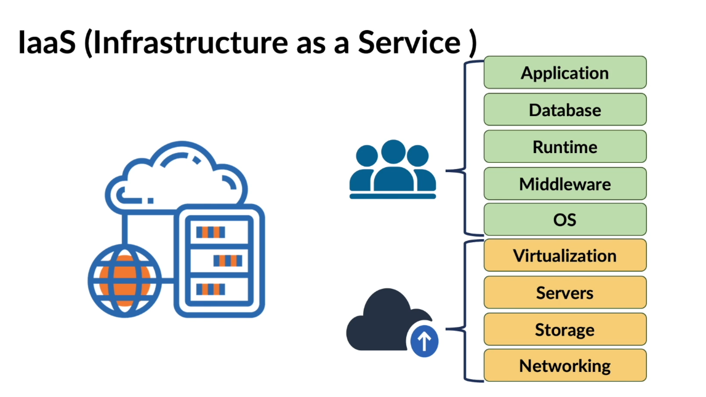

# Amazon Web Services

## What is Cloud Computing

Cloud Computing is an **on-demand delivery** of `**compute**`, `**storage**`, `**database**`, `**networking**`, and many more services over the internet.

1. `**Compute**`: is the **processing power** of your machine.
2. `**Storage**`: is where you can **store your data** within a data storage service.
3. `**Database**`: is a structured way to **store your data**.
4. `**Networking**`: is a service that provides **connectivity** among different services.

## Cloud Deployment Models

Cloud deployment models are needed because of the following;

- Different organizationa have different requirements.
- Each deployment model offers a different level of management, security and cost.

Attributes of cloud deployment model are based on the following;

- Location of the infrastructure.
- Ownership of the infrastructure.
- Access to the infrastructure.

There are three main cloud deployment models;

1; **Public Cloud**

Cloud computing infrastructure maintained and operated by a `**cloud service provider**`.
Anyone can use the public cloud when they have access to internet.
Cloud service provider is responsible for maintaining the physical infrastructure.

2; **Private Cloud**

Cloud computing infrastructure used exclusively by a `**single organization**`.
Cloud services are available to an organization and its users only.
Physical infrastructure can be maintained by either the organization or by a third-party providing the cloud services.
Private clouds are more expensive than public clouds.

3; **Hybrid Cloud**

Cloud computing infrastructure that benefits from both Public and Private models and enables organizations to use both.

## Cloud Service Models

Cloud service models includes;

1; **Infrastructure as a Service (IaaS)**
Provides virtualized computing resources over the internet.


Cloud providers will take care of core services like networking, storage, servers and virtualization.

2; **Platform as a Service (PaaS)**
Provides hardware and software tools over the internet.


Cloud providers will take care of runtime, middleware, and operating systems along with the core services like networking, storage, servers and virtualization

3; **Software as a Service (SaaS)**
Provides software applications over the internet.


Cloud providers will take care of applications along with the core services like networking, storage, servers, virtualization, runtime, middleware, and operating systems. E.g. Gmail, Google Drive, Dropbox.

## Key Cloud Concepts

1; **Scalability**
Scalability is the ability to increase or decrease IT resources as needed to meet changing demand.

`**Scaling-up/Vertical Scaling**`is when the computing power and other resources of a virtual machine is increased.

`**Scaling-down**`is when the computing power and other resources of a virtual machine is decreased.

`**Scaling-out/Horizontal Scaling**` is when more virtual machines are added to the existing pool of resources.

`**Scaling-in**` is when virtual machines are removed from the existing pool of resources.

2; **Elasticity**
Elasticity is the ability to automatically or dynamically increase or decrease IT resources as needed to meet changing demand.

3; **Agility**
Agility is the ability to rapidly develop, test, and launch applications.

4; **Fault Tolerance**
Fault Tolerance is the ability to continue operating properly in the event of the failure of some of its components.

5; **High Availability**
High Availability is the ability to operate continuously without failure for a long time.

## Benefits of Cloud Computing

1; **Cost Efficiency**
Cloud computing eliminates the capital expense of buying hardware and software and setting up and running on-site datacenters.

2; **Speed & Agility**
Most cloud computing services are provided self service and on demand, so even vast amounts of computing resources can be provisioned in minutes.

3; **Global Scale**
Cloud computing services can be scaled elastically, delivering the right amount of IT resources.

4; **Performance**
The biggest cloud computing services run on a worldwide network of secure datacenters, which are upgraded to the latest generation of fast and efficient computing hardware.

## Methods of Interacting with AWS

There are three main methods of interacting with AWS;
1; **AWS Management Console**
A web-based user interface that allows users to access and manage AWS services.

2; **AWS Command Line Interface (CLI)**
A unified tool to manage AWS services from the command line and automate them through scripts.

3; **AWS Software Development Kits (SDKs)**
A collection of libraries and tools that enable developers to build applications that interact with AWS services using various programming languages.

## AWS Regions and Availability Zones

AWS has a global infrastructure that consists of Regions and Availability Zones (AZs).

1; **AWS Regions**
Regions are separate geographic areas that AWS uses to house its data centers.
Each region is completely independent and isolated from other regions.
Region consist of multiple Availability zones.

2; **Availability Zones (AZs)**
AZs are isolated locations within a region that are designed to be independent of failures in other AZs.
Each region consists of multiple AZs to provide high availability and fault tolerance.
An AWS region must have two Availability Zones.

### Why the need for many regions

- Latency
- Compliance
- Disaster recovery
- Global applications
- Cost
- Reduced blast radius

## identity & Access Management Concept

**IAM** is an AWS servive that helps an organization to manage access of their AWS account and Services fo their organization people.

- **Identification**
Identification is the ability to identify a unique user.

- **Authorization**
Authentication is the process of recognizing a user's identity.

- **Authentication**
Authoriztion is the process of giving someone the permission to access something.

### Types of IAM Policies

- **Identity-based Policies**
Identity-based policies are attached to an Identity that are IAM user, group, and role.
Control the actions an Identity can perform on which resources and under what condition.

- **Resource-based Policies**
These policies are attached to an AWS resource such as an Amazon EC2 or S3 Bucket.
Control what actions a specified AWS Service or Identity can perform on other resources and under what conditions.

**Inline Policies** are directly attached to the user or group. They maintain a strict one-to-one relationship

## Amazon S3 Bucket

### Availability, Durability and Data Replication

- **Availability**
Refers to how long the system is operational and able to deliver data upon request.

- **Durability**
Refers to long-term data protection. Data should not be corrupted or lost in the long run.

- **Data Replication**
Data is replicated in all the Availability Zones in a Region.
Promised 99.99% availability of objects over a given year.

**Storage Classes**

| Storage Class                      | Description                                                                 | Use Case                                                                  | Durability | Availability         | Minimum Storage Duration |
|------------------------------------|-----------------------------------------------------------------------------|---------------------------------------------------------------------------|------------|----------------------|--------------------------|
| S3 Standard                        | High durability, availability, and low latency                              | Frequently accessed data, cloud apps, websites, content distribution      | 11 nines   | 99.99%               | None                     |
| S3 Intelligent-Tiering             | Moves data between tiers based on access patterns                           | Unknown/variable access patterns, cost optimization                       | 11 nines   | 99.9% (frequent)     | 30 days                  |
| S3 Standard-IA (Infrequent Access) | Lower-cost, high durability, but retrieval fee applies                      | Long-lived but less frequently accessed data                              | 11 nines   | 99.9%                | 30 days                  |
| S3 One Zone-IA                     | Cheaper than Standard-IA, stored in a single AZ                             | Non-critical, infrequently accessed data                                  | 11 nines   | 99.5%                | 30 days                  |
| S3 Glacier Instant Retrieval       | Millisecond access, lower cost than IA                                      | Archive data requiring immediate access                                   | 11 nines   | 99.9%                | 90 days                  |
| S3 Glacier Flexible Retrieval      | Minutes to hours retrieval (expedited, standard, bulk options)              | Long-term archives with occasional retrievals                             | 11 nines   | 99.99%               | 90 days                  |
| S3 Glacier Deep Archive            | Lowest-cost storage, retrieval in hours                                     | Long-term data archiving, compliance, backups                             | 11 nines   | 99.99%               | 180 days                 |
| S3 Outposts                        | Store objects locally on AWS Outposts hardware                              | On-premises data storage with S3 API integration                          | 11 nines   | Dependent on Outpost | None                     |

### Amazon S3 Static Website Hosting

- Object storage service with the **web hosting capabilities.
- Suitable for hosting static content.
- For serving content that does not change dynamically or require server-side processing

Benefits of Static Website Hosting include **Scalability**, **High Availability**, **Cost-effectiveness**

### Upload Static Website Content Using AWS CloudFormation/CLI

- Download all website files or copy files to destination for website.
- Unzip files
- Navigate to the website directory
- Run the command ```aws s3 ls``` to list all the buckets in your AWS account
- Copy the name of the bucket name you want to use
- Run the command ```aws s3 sync . s3://bucket-name``` to upload website content to S3 bucket
- Go into the bucket **Properties** tab, scroll down to **Static website hosting**.
- Click on **Edit** to and set **Static website hosting** to **Enable**
- Go down to **Index document** and the home or default page. E.g `index.html`. Save Changes.
- Next go to the **Permissions** tab and scroll down to **Block public access (bucket settings)**
- Edit and remove the checkbox for **Block all public access**. Type **confirm** in the popup box to save changes
- Still under **Permissions**, scroll down to **Bucket policy**, edit and type in the policy below. Make sure to replace **Resource** with the actual bucket name.

```json
{
    "Version": "2012-10-17",
    "Statement": [
        {
            "Sid": "PublicReadGetObject",
            "Effect": "Allow",
            "Principal": "*",
            "Action": [
                "s3:GetObject"
            ],
            "Resource": [
                "arn:aws:s3:::your-bucket-name/*"
            ]
        }
    ]
}
```
- Save the changes and try accesss the **website endpoint** in the browser.

## Amazon EBS (Elastic Block Storage)

Amazon EBS provides persistent block storage for Amazon EC2