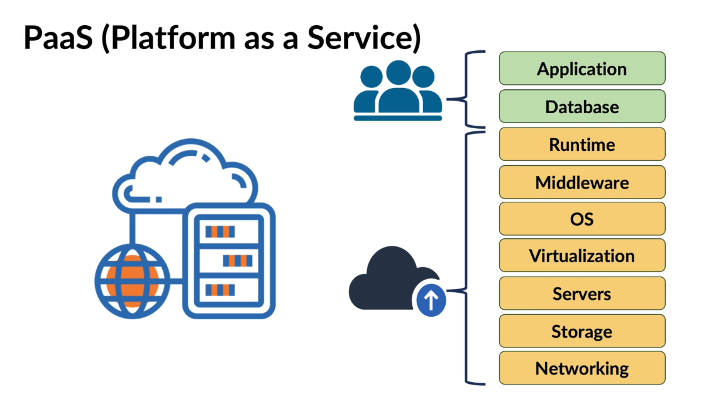

# Amazon Web Services

## What is Cloud Computing

Cloud Computing is an **on-demand delivery** of **compute**, **storage**, **database**, **networking**, and other services over the internet.

1. **Compute**: Processing power of your machine.  
2. **Storage**: Service for storing data.  
3. **Database**: Structured data storage and management.  
4. **Networking**: Provides connectivity among different services.

---

## Cloud Deployment Models

Cloud deployment models are needed because:

- Different organizations have different requirements.  
- Each model offers a unique level of management, security, and cost.

Attributes of deployment models depend on:

- Location of the infrastructure  
- Ownership of the infrastructure  
- Access to the infrastructure  

### Main Cloud Deployment Models

1. **Public Cloud**  
   Cloud infrastructure maintained and operated by a **cloud service provider**.  
   Anyone with internet access can use it.  
   The provider manages and maintains the physical infrastructure.

2. **Private Cloud**  
   Cloud infrastructure used exclusively by a **single organization**.  
   Services are available only to that organization and its users.  
   The infrastructure may be managed internally or by a third-party provider.  
   More expensive than public clouds.

3. **Hybrid Cloud**  
   Combines both public and private clouds to use the benefits of each.

---

## Cloud Service Models

1. **Infrastructure as a Service (IaaS)**  
   Provides virtualized computing resources over the internet.  
     
   Cloud providers manage networking, storage, servers, and virtualization.

2. **Platform as a Service (PaaS)**  
   Provides hardware and software tools over the internet.  
     
   Providers manage runtime, middleware, and operating systems along with core services.

3. **Software as a Service (SaaS)**  
   Provides software applications over the internet.  
     
   Providers manage the full stack including applications, infrastructure, and middleware.  
   Examples: Gmail, Google Drive, Dropbox.

---

## Key Cloud Concepts

1. **Scalability**  
   Ability to increase or decrease IT resources based on demand.  
   - **Scaling-up (Vertical Scaling)**: Increase VM resources.  
   - **Scaling-down**: Decrease VM resources.  
   - **Scaling-out (Horizontal Scaling)**: Add more VMs.  
   - **Scaling-in**: Remove VMs.

2. **Elasticity**  
   Automatically or dynamically adjust resources based on demand.

3. **Agility**  
   Rapidly develop, test, and deploy applications.

4. **Fault Tolerance**  
   Continue operating properly when components fail.

5. **High Availability**  
   Operate continuously without failure for long periods.

---

## Benefits of Cloud Computing

1. **Cost Efficiency** – Reduces hardware and on-site datacenter expenses.  
2. **Speed & Agility** – Resources are provisioned within minutes.  
3. **Global Scale** – Scale resources elastically.  
4. **Performance** – Runs on global networks of secure, high-performance datacenters.

---

## Methods of Interacting with AWS

1. **AWS Management Console** – Web-based interface to manage AWS services.  
2. **AWS Command Line Interface (CLI)** – Tool for managing AWS via terminal or scripts.  
3. **AWS Software Development Kits (SDKs)** – Libraries and tools for developers to build apps interacting with AWS.

---

## AWS Regions and Availability Zones

AWS global infrastructure consists of **Regions** and **Availability Zones (AZs)**.

1. **AWS Regions**  
   - Separate geographic areas housing AWS data centers.  
   - Each region is independent and contains multiple AZs.

2. **Availability Zones (AZs)**  
   - Isolated locations within regions, designed for fault tolerance.  
   - Each region has at least two AZs.

### Why Multiple Regions Exist

- Latency  
- Compliance  
- Disaster recovery  
- Global application reach  
- Cost management  
- Reduced impact of failures (blast radius)

---

## Identity & Access Management (IAM)

**IAM** helps organizations control access to AWS accounts and services.

- **Identification** – Recognize a unique user.  
- **Authentication** – Verify user identity.  
- **Authorization** – Grant permissions to access resources.

### Types of IAM Policies

- **Identity-based Policies** – Attached to IAM users, groups, or roles.  
  Define what actions an identity can perform, on which resources, and under what conditions.

- **Resource-based Policies** – Attached to AWS resources (e.g., EC2, S3).  
  Define who can access the resource and what actions they can perform.

- **Inline Policies** – Directly attached to a user or group (one-to-one relationship).

---

## Amazon S3 Bucket

### Availability, Durability, and Data Replication

- **Availability** – System uptime and responsiveness.  
- **Durability** – Long-term data protection and reliability.  
- **Data Replication** – Data replicated across AZs for redundancy.  

Promised **99.99%** availability of objects per year.

### S3 Storage Classes

| Storage Class                      | Description                                       | Use Case                                   | Durability | Availability         | Min Storage Duration |
|------------------------------------|---------------------------------------------------|--------------------------------------------|------------|----------------------|----------------------|
| S3 Standard                        | High durability, availability, and low latency    | Frequently accessed data                   | 11 nines   | 99.99%               | None                 |
| S3 Intelligent-Tiering             | Moves data between tiers based on access patterns | Variable access patterns                   | 11 nines   | 99.9% (frequent)     | 30 days              |
| S3 Standard-IA (Infrequent Access) | Low-cost, high durability, retrieval fee applies  | Long-lived but infrequently accessed data  | 11 nines   | 99.9%                | 30 days              |
| S3 One Zone-IA                     | Stored in a single AZ                             | Non-critical infrequently accessed data    | 11 nines   | 99.5%                | 30 days              |
| S3 Glacier Instant Retrieval       | Millisecond access, low cost                      | Archive data needing quick retrieval       | 11 nines   | 99.9%                | 90 days              |
| S3 Glacier Flexible Retrieval      | Minutes to hours retrieval                        | Long-term archives                         | 11 nines   | 99.99%               | 90 days              |
| S3 Glacier Deep Archive            | Lowest cost, retrieval in hours                   | Long-term archiving, compliance, backups   | 11 nines   | 99.99%               | 180 days             |
| S3 Outposts                        | On-premises object storage on Outposts hardware   | Local storage with S3 API                  | 11 nines   | Dependent on Outpost | None                 |

---

### Amazon S3 Static Website Hosting

- Object storage service with web hosting capabilities.  
- Suitable for hosting static content.  
- Does not support server-side processing.  

**Benefits:** Scalability, High Availability, Cost-effectiveness.

---

### Upload Static Website Content (AWS CloudFormation / CLI)

1. Download or prepare your website files.  
2. Unzip files if needed.  
3. Navigate to the website directory.  
4. Run `aws s3 ls` to list buckets.  
5. Copy the desired bucket name.  
6. Run `aws s3 sync . s3://bucket-name` to upload files.  
7. In the bucket **Properties** tab, enable **Static website hosting**.  
8. Set **Index document** to `index.html`.  
9. In **Permissions**, disable **Block all public access**.  
10. Under **Bucket policy**, use the following policy (replace `your-bucket-name`). Save and access the **website endpoint** in a browser.

```json
{
    "Version": "2012-10-17",
    "Statement": [
        {
            "Sid": "PublicReadGetObject",
            "Effect": "Allow",
            "Principal": "*",
            "Action": ["s3:GetObject"],
            "Resource": ["arn:aws:s3:::your-bucket-name/*"]
        }
    ]
}
```

---

### Amazon EBS (Elastic Block Storage)

Amazon EBS provides **persistent block storage** for EC2 instances.

1. **Block storage** splits data into blocks for flexible storage.
2. **EBS Volume** is a network-attached drive.
3. Can only attach to one EC2 instance at a time.
4. Restricted within one **Availability Zone**.

---

## Virtual Private Cloud (VPC)

Amazon VPC allows you to launch AWS resources into a virtual network that you define.
A **VPC** is an isolated logical network with its own **CIDR block** and spans multiple **Availability Zones**.

### Subnet

A **Subnet** is a range of IP addresses in your VPC.

1. **Public Subnet:** Has a route to an Internet Gateway. It has a routing table entry to the internet
2. **Private Subnet:** No direct internet route.

### Internet Gateway

An **Internet Gateway** enables communication between instances in your VPC and the internet.

### Route Table

A **Route Table** contains rules (routes) that determine where network traffic is directed.
Each subnet must be associated with a route table.

### NAT Gateway

A **NAT Gateway** allows instances in private subnets to connect to the internet while preventing inbound connections from the internet.

### Security Group & NACL

A **Security Group** acts as a virtual firewall for your instance to control inbound and outbound traffic. 
It represents instance-level security and both inbound/outbound rules work independently. 
An instance can be associated with one or more security groups.

A **Network Access Control List (NACL)** is an optional layer of security for your VPC that acts as a firewall for controlling traffic in and out of one or more subnets. 
NACL can be applied to one or more subnets. However, each subnet must be associated with one and only one NACL.

1. **Inbound**: refers to information coming into a network.


2. **Outbound**: refers to information going out of the network.


#### Difference between Security Group and NACL

| Security Group                        | NACL                                |
|---------------------------------------|-------------------------------------|
| Operates at the instance level        | Operates at the subnet level        |
| Stateful (State of allow traffic)     | Stateless                           |
| Allows rules only                     | Allows both allow and deny rules    |
| Can't delete a default security group | Can't delete default NACL           |

## Compute

AWS **compute** is an on-demand computing service for running cloud-based applications. 
AWS provides computing resources like instances (**virtual machines**) and **containers**. 
AWS also provides **severless computing** to run applications where you do not need infrastructure setup or configuration.

- **EC2 Instance**

- **ECS Container**

- **Lambda**

### Virtual Machine benefits

1. **Scalability** – Easily scale resources up or down based on demand.
2. **Cost Savingsy** – Pay only for the resources you use.
3. **Flexibility** – Choose from a variety of instance types and configurations.
4. **Agility and speed** - Quickly deploy and manage applications without physical hardware constraints.
5. **Lowered downtime** - High availability and disaster recovery options.


### Amazon EC2

Amazon Elastic Compute Cloud (EC2) provides scalable computing capacity in the AWS cloud.
You can launch virtual servers, configure security and networking, and manage storage.

### EC2 Instance Types

EC2 instance types are categorized based on their use cases:

1. **General Purpose**: Balanced CPU, memory, and networking resources. Suitable for a variety of workloads.
   - Examples: t3, m5
2. **Compute Optimized**: High-performance processors for compute-intensive tasks.
   - Examples: c5, c6g
3. **Memory Optimized**: High memory capacity for memory-intensive applications.
   - Examples: r5, x1e
4. **Storage Optimized**: High, sequential read and write access to large datasets on local storage.
   - Examples: i3, d2
5. **Accelerated Computing**: Use hardware accelerators or GPUs for specific tasks.
   - Examples: p3, g4dn

## Database

### Data Source Types
1. **Structured Data:** The data that has predefined data types and is stored in a specific format.

      | SL. No. | First Name    | Last Number     | Phone No.         |
      |---------|---------------|-----------------|-------------------|
      | 1       | Ram           | Brainage        | +1 6489643002     |
      | 2       | Derek         | Code            | +1 7579820921     |

2. **Unstructured Data:** This data has an internal structure but does not contain a predefined data model.

      - Text
      - Phone text messages
      - Videos
      - Photos

3. **Semi-structured Data:** Is a form of structured data.

      ```json
      {
         "name": "John Doe",
         "age": 30,
         "isStudent": false,
         "courses": ["Math", "Science"],
         "address": {
           "street": "123 Maple St",
           "city": "Anytown"
         },
         "contact": null
      }
      ```

### Database Technology

The database is an organized collection of data so that it can be easily accessed and managed.

### Relational Database

An organized collection of related data. It is an organized collection all data sets which are described and related to one another.

1. A table is a collection of data organized into a grid of rows and columns. 
Each table stores data about a specific subject, like "Customers" or "Products".

2. Columns, also called fields, define the attributes or characteristics of the data within a table.
Each column has a name and a specific data type (e.g., text, number, date) that determines the kind of data it can store. 

3. Records, or rows, represent a single entry or data item in a table.
Each row contains a unique value for each column. For example, a single row in a "Customers" table would represent one specific customer.

### Amazon RDS

Amazon RDS is a relational database service that lets you set up, operate, and scale a relational database in the cloud.

- Amazon RDS was designed to help you **reduce that database managment cost**.
- It is a managed service that **automates** the provisioning of databases.
- It supports **automated backup** and **point-in-time restore**.
- Reads can be scaled by creating a **read replica** and improving the **read performance**.
- RDS supports **Multi-AZ deployment** for High Availability
- Maintenance window can be set up for OS patching and upgrade
- RDS supports **vertical** and **horizontal** scaling.

