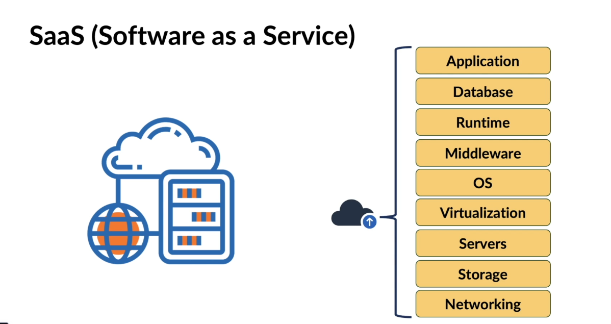

# Amazon Web Services

## What is Cloud Computing

Cloud Computing is an **on-demand delivery** of `**compute**`, `**storage**`, `**database**`, `**networking**`, and many more services over the internet.

1. `**Compute**`: is the **processing power** of your machine.
2. `**Storage**`: is where you can **store your data** within a data storage service.
3. `**Database**`: is a structured way to **store your data**.
4. `**Networking**`: is a service that provides **connectivity** among different services.

## Cloud Deployment Models

Cloud deployment models are needed because of the following;

- Different organizationa have different requirements.
- Each deployment model offers a different level of management, security and cost.

Attributes of cloud deployment model are based on the following;

- Location of the infrastructure.
- Ownership of the infrastructure.
- Access to the infrastructure.

There are three main cloud deployment models;

1; **Public Cloud**

Cloud computing infrastructure maintained and operated by a `**cloud service provider**`.
Anyone can use the public cloud when they have access to internet.
Cloud service provider is responsible for maintaining the physical infrastructure.

2; **Private Cloud**

Cloud computing infrastructure used exclusively by a `**single organization**`.
Cloud services are available to an organization and its users only.
Physical infrastructure can be maintained by either the organization or by a third-party providing the cloud services.
Private clouds are more expensive than public clouds.

3; **Hybrid Cloud**

Cloud computing infrastructure that benefits from both Public and Private models and enables organizations to use both.

## Cloud Service Models

Cloud service models includes;

1; **Infrastructure as a Service (IaaS)**
Provides virtualized computing resources over the internet.

Cloud providers will take care of core services like networking, storage, servers and virtualization.

2; **Platform as a Service (PaaS)**
Provides hardware and software tools over the internet.

Cloud providers will take care of runtime, middleware, and operating systems along with the core services like networking, storage, servers and virtualization

3; **Software as a Service (SaaS)**
Provides software applications over the internet.

Cloud providers will take care of applications along with the core services like networking, storage, servers, virtualization, runtime, middleware, and operating systems. E.g. Gmail, Google Drive, Dropbox.

## Key Cloud Concepts

1; **Scalability**
Scalability is the ability to increase or decrease IT resources as needed to meet changing demand.

`**Scaling-up/Vertical Scaling**`is when the computing power and other resources of a virtual machine is increased.

`**Scaling-down**`is when the computing power and other resources of a virtual machine is decreased.

`**Scaling-out/Horizontal Scaling**` is when more virtual machines are added to the existing pool of resources.

`**Scaling-in**` is when virtual machines are removed from the existing pool of resources.

2; **Elasticity**
Elasticity is the ability to automatically or dynamically increase or decrease IT resources as needed to meet changing demand.

3; **Agility**
Agility is the ability to rapidly develop, test, and launch applications.

4; **Fault Tolerance**
Fault Tolerance is the ability to continue operating properly in the event of the failure of some of its components.

5; **High Availability**
High Availability is the ability to operate continuously without failure for a long time.

## Benefits of Cloud Computing

1; **Cost Efficiency**
Cloud computing eliminates the capital expense of buying hardware and software and setting up and running on-site datacenters.
2; **Speed & Agility**
Most cloud computing services are provided self service and on demand, so even vast amounts of computing resources can be provisioned in minutes.
3; **Global Scale**
Cloud computing services can be scaled elastically, delivering the right amount of IT resources.
4; **Performance**
The biggest cloud computing services run on a worldwide network of secure datacenters, which are upgraded to the latest generation of fast and efficient computing hardware.

## Methods of Interacting with AWS

There are three main methods of interacting with AWS;
1; **AWS Management Console**
A web-based user interface that allows users to access and manage AWS services.
2; **AWS Command Line Interface (CLI)**
A unified tool to manage AWS services from the command line and automate them through scripts.
3; **AWS Software Development Kits (SDKs)**
A collection of libraries and tools that enable developers to build applications that interact with AWS services using various programming languages.

## AWS Regions and Availability Zones

AWS has a global infrastructure that consists of Regions and Availability Zones (AZs).

1; **AWS Regions**
Regions are separate geographic areas that AWS uses to house its data centers.
Each region is completely independent and isolated from other regions.

2; **Availability Zones (AZs)**
AZs are isolated locations within a region that are designed to be independent of failures in other AZs.
Each region consists of multiple AZs to provide high availability and fault tolerance.
